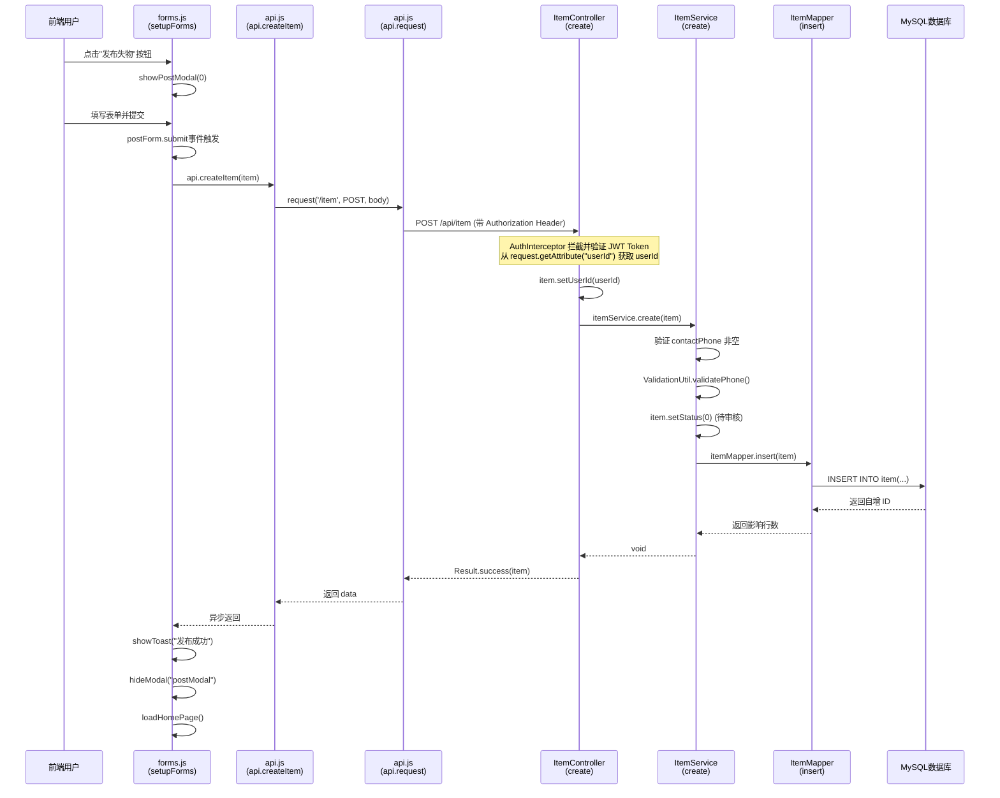

# 校园失物招领系统代码分析报告

---

## 一、发布失物完整调用链路

### 1.1 调用链路总览



### 1.2 详细步骤说明

#### 前端流程

| 步骤 | 文件 | 函数/代码 | 说明 |
|------|------|-----------|------|
| 1 | `forms.js:54-86` | `postForm` submit 事件监听器 | 用户填写表单后提交，触发此回调 |
| 2 | `forms.js:66-69` | 处理 itemTime 格式 | 将 datetime-local 值转换为 `YYYY-MM-DD HH:mm:ss` 格式 |
| 3 | `forms.js:70-79` | 构建 item 对象 | 包含 type、title、category、description、location、itemTime、contactName、contactPhone |
| 4 | `api.js:108-113` | `api.createItem(item)` | 调用 API 模块创建物品 |
| 5 | `api.js:24-52` | `api.request(url, options)` | 统一请求方法，自动添加 `Authorization: Bearer ${token}` 头 |
| 6 | `forms.js:80-82` | 成功回调 | 显示 Toast、关闭弹窗、刷新首页 |

#### HTTP 请求信息

- **URL**: `POST /api/item`
- **方法**: `POST`
- **Content-Type**: `application/json`
- **请求头**: `Authorization: Bearer ${jwt_token}`
- **请求体 JSON 结构**:
```json
{
  "type": 0,
  "title": "丢失手机",
  "category": "Electronics",
  "description": "黑色iPhone",
  "location": "图书馆",
  "itemTime": "2024-01-15 14:30:00",
  "contactName": "张三",
  "contactPhone": "13800138000"
}
```

#### 后端流程

| 步骤 | 文件 | 函数/代码 | 说明 |
|------|------|-----------|------|
| 1 | `AuthInterceptor.java:32-61` | `preHandle()` | 拦截器验证 JWT Token，解析 userId 存入 request 属性 |
| 2 | `ItemController.java:68-74` | `create()` | 从 request 获取 userId 并设置到 item 对象 |
| 3 | `ItemService.java:33-42` | `create()` | 业务层处理：验证手机号、设置 status=0 (待审核) |
| 4 | `ItemMapper.java:14-17` | `insert()` | MyBatis Mapper 接口 |
| 5 | `ItemMapper.xml` 对应的注解 | `@Insert` SQL | 执行 INSERT 语句，使用 `@Options(useGeneratedKeys=true)` 获取自增 ID |

#### 数据库表结构

**表名: `item`**

| 字段 | 类型 | 说明 |
|------|------|------|
| `id` | BIGINT (PK, AUTO_INCREMENT) | 主键 |
| `user_id` | BIGINT (FK) | 发布者用户ID |
| `title` | VARCHAR(200) | 标题 |
| `description` | TEXT | 详细描述 |
| `category` | VARCHAR(50) | 分类 (Electronics/Card/Bag/Book/Clothing/Other) |
| `location` | VARCHAR(200) | 丢失/捡到地点 |
| `images` | TEXT | 图片（JSON格式） |
| `type` | TINYINT | 0=失物, 1=招领 |
| `status` | TINYINT | 0=待审核, 1=已通过, 2=已拒绝, 3=已认领 |
| `contact_name` | VARCHAR(50) | 联系人姓名 |
| `contact_phone` | VARCHAR(20) | 联系电话 |
| `item_time` | DATETIME | 丢失/捡到时间 |
| `create_time` | DATETIME | 创建时间 (默认 CURRENT_TIMESTAMP) |
| `update_time` | DATETIME | 更新时间 (ON UPDATE CURRENT_TIMESTAMP) |

---

## 二、智能匹配功能分析

### 2.1 当前实现

**核心代码位置**: `ItemService.java:75-92` 和 `ItemMapper.xml:48-63`

匹配算法逻辑：
```sql
SELECT i.*, u.username,
    (
        CASE WHEN i.category = #{category} THEN 50 ELSE 0 END +
        CASE WHEN i.location LIKE CONCAT('%', #{location}, '%') OR #{location} LIKE CONCAT('%', i.location, '%') THEN 30 ELSE 0 END +
        CASE WHEN ABS(DATEDIFF(i.create_time, #{createTime})) <= 7 THEN 20 - ABS(DATEDIFF(i.create_time, #{createTime})) * 2 ELSE 0 END
    ) AS match_score
FROM item i
LEFT JOIN user u ON i.user_id = u.id
WHERE i.type = #{matchType}
  AND i.status = 1
  AND i.id != #{excludeId}
HAVING match_score > 0
ORDER BY match_score DESC, i.create_time DESC
LIMIT #{limit}
```

**评分规则**:
- 相同分类: +50 分
- 地点包含关系: +30 分
- 时间差 7 天内: 20 - 天数×2 分 (最多 20 分, 最少 6 分)

---

### 2.2 潜在问题与优化方案

#### 问题一：地点匹配精度不足（匹配逻辑过于简单）

**问题描述**:
当前地点匹配仅使用 `LIKE` 包含关系判断，存在以下缺陷：
- "图书馆一楼" 和 "图书馆二楼" 会被判定为完全匹配（+30分），但实际地点相差较远
- "第一食堂" 和 "第二食堂" 也会被判定为包含匹配
- 完全不相关的地点如果恰好有字符重叠也会误判
- 无法处理同义词（如"饭堂" vs "食堂"，"教学楼" vs "教学大楼"）

**具体代码位置**: `ItemMapper.xml:52`
```sql
CASE WHEN i.location LIKE CONCAT('%', #{location}, '%') OR #{location} LIKE CONCAT('%', i.location, '%') THEN 30 ELSE 0 END
```

**改进方案**:

1. **分级评分机制**: 根据匹配程度给分，而非二元判断
```sql
CASE 
    WHEN i.location = #{location} THEN 30           -- 完全匹配
    WHEN i.location LIKE CONCAT(#{location}, '%') 
         OR i.location LIKE CONCAT('%', #{location}) THEN 20  -- 前缀/后缀匹配
    WHEN i.location LIKE CONCAT('%', #{location}, '%') 
         OR #{location} LIKE CONCAT('%', i.location, '%') THEN 10  -- 包含匹配
    ELSE 0 
END
```

2. **引入地理位置标准化**: 在数据库中维护地点层级表（区域→建筑→楼层→房间），匹配时根据层级距离计算分数

3. **地点同义词映射**: 建立地点同义词词典，在匹配前做标准化转换

---

#### 问题二：性能瓶颈（全表扫描 + 无索引）

**问题描述**:
- `WHERE i.type = #{matchType} AND i.status = 1` 条件无索引，需全表扫描
- `HAVING match_score > 0` 必须在计算完所有行的分数后才能过滤
- 随着数据量增大，查询性能会显著下降
- `DATEDIFF` 和 `LIKE` 操作无法利用索引

**具体代码位置**: `ItemMapper.xml:48-63`

**改进方案**:

1. **添加复合索引**:
```sql
CREATE INDEX idx_item_type_status ON item(type, status, create_time);
```

2. **预过滤减少计算量**: 先通过时间范围过滤，再计算分数
```sql
SELECT i.*, u.username,
    (...) AS match_score
FROM item i
LEFT JOIN user u ON i.user_id = u.id
WHERE i.type = #{matchType}
  AND i.status = 1
  AND i.id != #{excludeId}
  AND i.create_time >= DATE_SUB(#{createTime}, INTERVAL 7 DAY)
  AND i.create_time <= DATE_ADD(#{createTime}, INTERVAL 7 DAY)
HAVING match_score > 0
ORDER BY match_score DESC, i.create_time DESC
LIMIT #{limit}
```

3. **考虑使用全文索引**: 对 location、title、description 字段添加 FULLTEXT 索引，使用 `MATCH AGAINST` 代替 `LIKE`

---

#### 问题三：边界情况未处理（多维度缺陷）

**问题描述**:

1. **地点为空的情况**: 如果某条记录的 location 为 NULL 或空字符串，`LIKE` 比较会返回 NULL，被当作 0 分处理，但可能用户实际有地点信息
2. **标题和描述未参与匹配**: 评分仅考虑分类、地点、时间三个维度，忽略了 title 和 description 中的关键词信息
3. **时间维度使用 create_time 而非 item_time**: 应使用物品实际丢失/捡到的时间 (item_time) 而非发布时间 (create_time)
4. **分类为 NULL 的记录**: 如果 category 为 NULL，即使其他条件匹配也会丢失 50 分的基础分

**具体代码位置**: `ItemMapper.xml:49-54`
```sql
CASE WHEN i.category = #{category} THEN 50 ELSE 0 END  -- NULL = 'xxx' 返回 NULL → 0分
CASE WHEN ABS(DATEDIFF(i.create_time, #{createTime})) ...  -- 应使用 item_time
```

**改进方案**:

1. **NULL 值处理**: 使用 COALESCE 处理 NULL 值
```sql
CASE WHEN COALESCE(i.category, '') = COALESCE(#{category}, '') THEN 50 
     WHEN i.category IS NULL OR #{category} IS NULL THEN 15  -- 任一方为空给少量安慰分
     ELSE 0 
END
```

2. **使用 item_time 而非 create_time**:
```sql
CASE WHEN ABS(DATEDIFF(COALESCE(i.item_time, i.create_time), COALESCE(#{itemTime}, #{createTime}))) <= 7 
     THEN 20 - ABS(DATEDIFF(...)) * 2 
     ELSE 0 
END
```

3. **引入标题和描述的关键词匹配**:
```sql
CASE WHEN i.title LIKE CONCAT('%', SUBSTRING_INDEX(#{title}, ' ', 1), '%') THEN 10 ELSE 0 END +
CASE WHEN i.description LIKE CONCAT('%', SUBSTRING_INDEX(#{title}, ' ', 1), '%') THEN 5 ELSE 0 END
```

4. **增加相似度阈值**: 对于 match_score 低于某个阈值（如 20 分）的结果不返回，避免低质量推荐

---

## 三、认证机制安全分析

### 3.1 当前实现概述

#### JWT Token 生成

**代码位置**: `JwtUtil.java:35-42`
```java
public String generateToken(Long userId, String username, Integer role) {
    return JWT.create()
            .withClaim("userId", userId)
            .withClaim("username", username)
            .withClaim("role", role)
            .withExpiresAt(new Date(System.currentTimeMillis() + expiration))
            .sign(Algorithm.HMAC256(secret));
}
```

#### Token 验证与拦截

**代码位置**: `AuthInterceptor.java:32-61`
```java
@Override
public boolean preHandle(HttpServletRequest request, HttpServletResponse response, Object handler) throws Exception {
    if ("OPTIONS".equalsIgnoreCase(request.getMethod())) {
        return true;
    }
    String token = request.getHeader("Authorization");
    if (token == null || !token.startsWith("Bearer ")) {
        writeErrorResponse(response, ErrorCode.UNAUTHORIZED);
        return false;
    }
    try {
        token = token.substring(7);
        Long userId = jwtUtil.getUserId(token);  // 内部调用 verifyToken()
        String username = jwtUtil.getUsername(token);
        Integer role = jwtUtil.getRole(token);
        request.setAttribute("userId", userId);
        // ...
        return true;
    } catch (Exception e) {
        writeErrorResponse(response, ErrorCode.TOKEN_EXPIRED);
        return false;
    }
}
```

#### Token 存储（前端）

**代码位置**: `api.js:7-8, 10-15`
```javascript
token: localStorage.getItem('token'),
user: JSON.parse(localStorage.getItem('user') || 'null'),

setAuth(token, user) {
    this.token = token;
    this.user = user;
    localStorage.setItem('token', token);
    localStorage.setItem('user', JSON.stringify(user));
}
```

#### 配置信息

**代码位置**: `application.properties:1-3`
```properties
jwt.secret=campus-lost-found-secret-key-2024
jwt.expiration=86400000  # 24小时
```

---

### 3.2 安全漏洞与修复建议

#### 安全风险一：JWT 密钥硬编码 + 强度不足

**漏洞描述**:

1. **密钥硬编码在配置文件中**: `jwt.secret=campus-lost-found-secret-key-2024` 以明文形式存储在 `application.properties` 中，一旦代码仓库泄露，所有 Token 都可被伪造
2. **密钥强度不足**: 密钥仅 30 个字符，虽然 HMAC256 要求至少 32 字节，但该密钥缺乏足够的熵，易被暴力破解
3. **默认密钥兜底**: `JwtUtil.java:22-32` 中如果配置未加载，会使用硬编码的 `DEFAULT_SECRET = "campus-lost-found-secret-key-2024"`，与配置文件相同，进一步增加风险
4. **密钥无过期/轮换机制**: 密钥一旦泄露，所有历史 Token 均受影响，无法快速作废

**风险等级**: **高**

**具体代码位置**:
- `JwtUtil.java:15-32` - 密钥配置和默认值
- `application.properties:2` - 明文密钥

**修复建议**:

1. **使用环境变量或密钥管理服务**:
```properties
# 从环境变量读取，不要硬编码
jwt.secret=${JWT_SECRET}
```

2. **移除默认密钥兜底**: 删除 `DEFAULT_SECRET`，配置缺失时直接启动失败而非降级
```java
@PostConstruct
public void init() {
    if (secret == null || secret.isEmpty()) {
        throw new IllegalStateException("JWT secret must be configured");
    }
    // ...
}
```

3. **使用更强的密钥生成策略**: 至少 64 字节的随机字符串
```bash
# 生成强密钥
openssl rand -base64 64
```

4. **实现密钥轮换机制**: 支持多密钥验证，旧密钥逐步淘汰

---

#### 安全风险二：Token 存储在 localStorage 中易受 XSS 攻击

**漏洞描述**:

1. **Token 存储在 localStorage**: `api.js:13` 使用 `localStorage.setItem('token', token)` 存储 Token
2. **localStorage 易受 XSS 攻击**: 任何成功的 XSS 攻击都可以通过 `localStorage.getItem('token')` 窃取用户 Token
3. **无 HttpOnly Cookie 保护**: 未使用 HttpOnly Cookie，无法防止 JavaScript 读取 Token
4. **Token 过期时间过长**: 24 小时的过期时间意味着一旦 Token 泄露，攻击者有充足时间滥用

**风险等级**: **高**

**具体代码位置**: `api.js:7-22`
```javascript
setAuth(token, user) {
    this.token = token;
    this.user = user;
    localStorage.setItem('token', token);          // 不安全
    localStorage.setItem('user', JSON.stringify(user));  // 不安全
}
```

**修复建议**:

1. **使用 HttpOnly + Secure Cookie 存储 Token**:
```java
// 后端登录接口设置 Cookie
@PostMapping("/login")
public Result<?> login(@RequestBody Map<String, String> params, HttpServletResponse response) {
    // ... 验证逻辑
    String token = jwtUtil.generateToken(user.getId(), user.getUsername(), user.getRole());
    
    Cookie cookie = new Cookie("jwt_token", token);
    cookie.setHttpOnly(true);       // 禁止 JavaScript 读取
    cookie.setSecure(true);         // 仅 HTTPS 传输
    cookie.setPath("/");
    cookie.setMaxAge(86400);        // 24小时
    response.addCookie(cookie);
    
    // ...
}
```

2. **缩短 Token 有效期 + 引入 Refresh Token**:
```properties
jwt.expiration=3600000  # 改为 1 小时
jwt.refresh.expiration=604800000  # Refresh Token 7 天
```

3. **如必须使用 localStorage，添加 XSS 防护措施**:
   - 严格的 Content-Security-Policy 头
   - 所有用户输入输出进行 HTML 转义（当前 `app.js:106, 108` 已使用 `escapeHtml`，这点做得不错）
   - 定期轮换 Token

---

#### 安全风险三：CORS 配置过于宽松 + CSRF 防护缺失

**漏洞描述**:

1. **CORS Origin 反射**: `CorsFilter.java:24` 使用 `httpRequest.getHeader("Origin")` 动态设置 `Access-Control-Allow-Origin`，等同于 `*`，允许任意域名跨域访问
2. **允许携带凭证**: `Access-Control-Allow-Credentials: true` 配合宽松的 Origin，使 CSRF 攻击成为可能
3. **无 CSRF Token 验证**: 系统未实现任何 CSRF 防护机制（如 CSRF Token、SameSite Cookie 等）
4. **AuthInterceptor 仅检查 Token 存在性**: 不验证请求来源，只要有有效 Token 就放行

**风险等级**: **中高**

**具体代码位置**: `CorsFilter.java:23-28`
```java
httpResponse.setHeader("Access-Control-Allow-Origin", httpRequest.getHeader("Origin"));  // 反射任意 Origin
httpResponse.setHeader("Access-Control-Allow-Credentials", "true");  // 允许携带凭证
```

**修复建议**:

1. **限制允许的 Origin 列表**:
```java
private static final Set<String> ALLOWED_ORIGINS = Set.of(
    "http://localhost:8080",
    "http://localhost:3000",
    "https://yourdomain.com"
);

@Override
public void doFilter(...) {
    String origin = httpRequest.getHeader("Origin");
    if (ALLOWED_ORIGINS.contains(origin)) {
        httpResponse.setHeader("Access-Control-Allow-Origin", origin);
    }
    // ...
}
```

2. **使用 SameSite Cookie**:
```java
Cookie cookie = new Cookie("jwt_token", token);
cookie.setHttpOnly(true);
cookie.setSecure(true);
cookie.setPath("/");
cookie.setAttribute("SameSite", "Strict");  // 或 "Lax"
```

3. **如使用 Token 认证，确保不依赖 Cookie**: 如果坚持使用 Authorization Header 传递 Token，CSRF 风险较低，但仍需限制 CORS Origin

---

#### 安全风险四：异常类型混淆（Token 过期与无效使用相同错误码）

**漏洞描述**:

`AuthInterceptor.java:57-61` 将所有 JWT 验证异常都返回 `TOKEN_EXPIRED` (2002)，无法区分：
- Token 真正过期
- Token 被篡改（签名无效）
- Token 格式错误
- Token 算法不匹配

这可能导致：
1. 前端无法正确处理不同情况（如过期应刷新，篡改应拒绝）
2. 攻击者可以通过错误信息推断验证逻辑

**风险等级**: **低**

**修复建议**:
```java
catch (TokenExpiredException e) {
    writeErrorResponse(response, ErrorCode.TOKEN_EXPIRED);
} catch (JWTVerificationException e) {
    writeErrorResponse(response, ErrorCode.UNAUTHORIZED);  // 统一用 2001
}
```

---

## 四、总结

| 分析模块 | 主要发现 | 建议优先级 |
|---------|---------|-----------|
| **发布链路** | 流程完整，权限控制合理 | - |
| **智能匹配** | 地点匹配精度不足、性能瓶颈、边界情况未处理 | 高 |
| **认证安全** | 密钥硬编码、localStorage 存储、CORS 宽松 | 高 |

建议优先处理认证安全问题，其次优化智能匹配算法。
