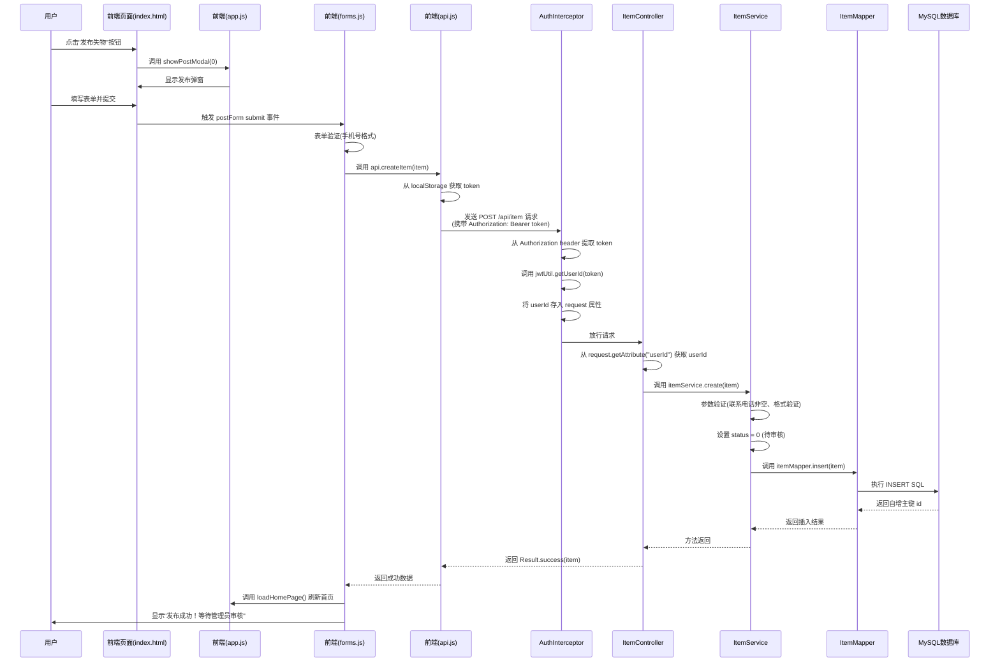

# 校园失物招领系统代码分析报告

## 一、发布失物功能完整调用链路

### 1.1 调用流程时序图



### 1.2 详细调用链路说明

#### 前端调用顺序
1. **用户点击按钮触发 `showPostModal(0)` (`app.js:456`)
2. 表单提交触发 `postForm` 的 `submit` 事件 (`forms.js:54`)
3. 调用 `api.createItem(item)` (`api.js:108-113`)
4. `api.request()` 方法添加 `Authorization` 请求头 (`api.js:24-52`)

#### HTTP 请求信息
- **URL**: `POST /api/item`
- **Method**: POST
- **Headers**: `Authorization: Bearer <token>`
- **Content-Type**: `application/json`

#### 请求体数据字段
```json
{
    "type": 0,
    "title": "物品标题",
    "category": "分类",
    "description": "描述",
    "location": "地点",
    "itemTime": "YYYY-MM-DD HH:mm:ss",
    "contactName": "联系人",
    "contactPhone": "联系电话"
}
```

#### 后端调用路径
1. **拦截器**: `AuthInterceptor.preHandle()` (`AuthInterceptor.java:32-62`)
   - 验证 JWT Token
   - 解析出 `userId`, `username`, `role`
   - 存入 `request.setAttribute("userId", userId)

2. **Controller**: `ItemController.create()` (`ItemController.java:68-74`)
   - 从 request 获取 userId
   - 调用 `itemService.create(item)`

3. **Service**: `ItemService.create()` (`ItemService.java:33-42`)
   - 验证联系电话非空
   - 调用 `ValidationUtil.validatePhone()` 验证手机号格式
   - 设置 `status = 0` (待审核状态)
   - 调用 `itemMapper.insert(item)`

4. **Mapper**: `ItemMapper.insert()` (`ItemMapper.java:14-17`)
   - 使用 `@Insert` 注解执行 SQL
   - `@Options(useGeneratedKeys = true, keyProperty = "id")` 获取自增主键

#### 数据库表及字段
**表名**: `item`

| 字段名 | 类型 | 说明 |
|--------|------|------|
| `id` | BIGINT | 主键，自增 |
| `user_id` | BIGINT | 发布者用户ID |
| `title` | VARCHAR(200) | 物品标题 |
| `description` | TEXT | 物品描述 |
| `category` | VARCHAR(50) | 物品分类 |
| `location` | VARCHAR(200) | 丢失/捡到地点 |
| `images` | TEXT | 图片URL |
| `type` | TINYINT | 类型：0=失物, 1=招领 |
| `status` | TINYINT | 状态：0=待审核, 1=已通过, 2=已拒绝, 3=已认领 |
| `contact_name` | VARCHAR(50) | 联系人姓名 |
| `contact_phone` | VARCHAR(20) | 联系电话 |
| `item_time` | DATETIME | 丢失/捡到时间 |
| `create_time` | DATETIME | 创建时间 |
| `update_time` | DATETIME | 更新时间 |

---

## 二、智能匹配功能分析

### 2.1 匹配算法实现

**核心代码位置**: `ItemService.findMatches()` (`ItemService.java:75-92`)
**SQL 实现**: `ItemMapper.xml:48-63`

#### 匹配逻辑：
1. **类型匹配**: 查找相反类型的物品（失物找招领，招领找失物）
2. **分类匹配**: 相同分类 +50 分
3. **地点匹配**: 地点互相包含 +30 分
4. **时间匹配**: 7天内，每天递减分数（20 - 天数×2）
5. **过滤条件**: 已审核通过(status=1)、排除自身、分数>0
6. **排序**: 按匹配分数降序，创建时间降序

### 2.2 存在的问题及优化方案

#### 问题一：地点匹配精度不足

**问题描述**:
当前地点匹配使用简单的字符串包含判断：
```sql
CASE WHEN i.location LIKE CONCAT('%', #{location}, '%') OR #{location} LIKE CONCAT('%', i.location, '%') THEN 30 ELSE 0 END
```

这种方式存在以下问题：
- 语义差异无法识别（如"图书馆一楼"和"图书馆二楼"会被判定为完全匹配）
- 同义表述无法识别（如"一食堂"和"第一食堂"无法匹配）
- 地点范围无法识别（如"教学楼A栋"和"教学楼"匹配，但"教学楼"和"A栋"不匹配）

**优化方案**:
1. 建立地点同义词映射表，对地点进行标准化处理
2. 引入地理编码，将地点映射到标准化的地点层级（校区→区域→建筑→楼层）
3. 使用编辑距离算法（如Levenshtein距离）计算地点相似度
4. 示例改进 SQL：
```sql
-- 改进后的地点匹配
CASE 
    WHEN i.location = #{location} THEN 30
    WHEN i.location LIKE CONCAT('%', #{location}, '%') OR #{location} LIKE CONCAT('%', i.location, '%') THEN 20
    WHEN LEVENSHTEIN(i.location, #{location}) <= 3 THEN 10
    ELSE 0 
END
```

#### 问题二：性能瓶颈 - 全表扫描

**问题描述**:
当前匹配逻辑对所有 `type = #{matchType} AND status = 1` 的记录进行全表扫描计算分数，当数据量增大时性能会显著下降。
- 没有使用索引优化地点和分类的过滤
- 每次查询都需要对所有符合条件的记录计算匹配分数
- 没有缓存机制，相同物品重复查询时重复计算

**优化方案**:
1. 添加复合索引：`CREATE INDEX idx_item_type_status ON item(type, status)`
2. 添加分类索引：`CREATE INDEX idx_item_category ON item(category)`
3. 引入 Redis 缓存匹配结果，设置合理的过期时间（如5分钟）
4. 对7天前的物品进行预计算匹配结果缓存
5. 分页加载匹配结果，避免一次性计算过多数据

#### 问题三：边界情况未处理

**问题描述**:
1. **空值处理不完善**: 当 `category` 或 `location` 为 NULL 时，匹配逻辑可能出现异常
2. **时间范围过于严格**: 只匹配7天内的物品，超过7天的完全无法匹配
3. **标题和描述未参与匹配**: 只使用了分类、地点、时间，未利用标题和描述中的关键词
4. **匹配分数权重不合理**: 分类占比过高(50%)，地点(30%)，时间(20%)，总分为100分，但实际场景中地点可能更重要
5. **未考虑物品状态变化**: 已认领的物品(status=3)应该从匹配池中排除，但当前只排除status≠1

**优化方案**:
1. **空值处理**:
```sql
-- 处理空值情况
CASE WHEN i.category = #{category} AND #{category} IS NOT NULL AND #{category} != '' THEN 50 ELSE 0 END
```

2. **时间梯度调整**:
```sql
-- 扩展到30天，分数梯度递减
CASE 
    WHEN ABS(DATEDIFF(i.item_time, #{itemTime})) <= 3 THEN 25
    WHEN ABS(DATEDIFF(i.item_time, #{itemTime})) <= 7 THEN 20
    WHEN ABS(DATEDIFF(i.item_time, #{itemTime})) <= 14 THEN 15
    WHEN ABS(DATEDIFF(i.item_time, #{itemTime})) <= 30 THEN 10
    ELSE 5
END
```

3. **引入标题/描述关键词匹配**:
```sql
-- 添加关键词匹配分数
CASE WHEN i.title LIKE CONCAT('%', #{keyword}, '%') OR i.description LIKE CONCAT('%', #{keyword}, '%') THEN 20 ELSE 0 END
```

4. **调整权重比例**: 地点40分，分类30分，时间20分，关键词10分

---

## 三、认证机制安全分析

### 3.1 JWT 认证流程

#### Token 生成 (`JwtUtil.java:35-42`):
```java
public String generateToken(Long userId, String username, Integer role) {
    return JWT.create()
            .withClaim("userId", userId)
            .withClaim("username", username)
            .withClaim("role", role)
            .withExpiresAt(new Date(System.currentTimeMillis() + expiration))
            .sign(Algorithm.HMAC256(secret));
}
```

#### Token 验证流程:
1. 前端从 `localStorage` 读取 token (`api.js:7`)
2. 请求时添加 `Authorization: Bearer <token>` 头 (`api.js:30-32`)
3. 拦截器 `AuthInterceptor.preHandle()` 验证 token (`AuthInterceptor.java:38-61`)
4. 调用 `jwtUtil.verifyToken(token)` 解析并验证

### 3.2 安全风险分析

#### 风险一：Token 存储在 localStorage 存在 XSS 攻击风险

**问题描述**:
Token 存储在 `localStorage` 中（`api.js:7,13,20`），存在以下风险：
- 如果网站存在 XSS 漏洞，攻击者可以通过注入恶意脚本窃取 Token
- `localStorage` 中的数据可以被任何同源页面的 JavaScript 访问
- 没有 HttpOnly 标志保护

**代码证据**:
```javascript
// api.js:7 - 从 localStorage 读取 token
token: localStorage.getItem('token'),

// api.js:13 - 存储 token 到 localStorage
localStorage.setItem('token', token);

// api.js:20 - 从 localStorage 清除 token
localStorage.removeItem('token');
```

**修复建议**:
1. 使用 HttpOnly + Secure Cookie 存储 Token：
```java
// 后端设置 Cookie
Cookie cookie = new Cookie("token", token);
cookie.setHttpOnly(true);
cookie.setSecure(true); // 仅 HTTPS 传输
cookie.setPath("/");
cookie.setMaxAge(24 * 60 * 60);
response.addCookie(cookie);
```

2. 如果必须使用 localStorage，实施以下防护：
   - 实施严格的内容安全策略(CSP)
   - 对所有用户输入进行严格的 XSS 过滤和转义
   - 定期轮换 Token（缩短过期时间）

#### 风险二：密钥硬编码且过于简单

**问题描述**:
1. **密钥硬编码在配置文件中 (`application.properties:2`):
```properties
jwt.secret=campus-lost-found-secret-key-2024
```

2. **默认密钥硬编码在代码中** (`JwtUtil.java:22`):
```java
private static final String DEFAULT_SECRET = "campus-lost-found-secret-key-2024";
```

3. 密钥强度不足，容易被暴力破解
4. 没有密钥轮换机制

**修复建议**:
1. **使用环境变量或密钥管理服务**存储密钥，不要硬编码：
```properties
# 从环境变量读取
jwt.secret=${JWT_SECRET}
```

2. **增强密钥强度**：使用至少32位的随机字符串
```bash
# 生成强密钥示例
openssl rand -hex 32
```

3. **移除代码中的默认密钥**，配置缺失时直接抛出异常而非使用默认值

4. **实现密钥轮换机制**：
   - 支持多密钥验证（旧密钥验证过渡）
   - 定期更新密钥
   - 使用密钥版本号区分不同版本的密钥

#### 风险三：CSRF 防护缺失

**问题描述**:
系统使用 Bearer Token 在 Authorization header 中传输，虽然一定程度上可以防止 CSRF，但仍存在风险：
- 没有验证请求来源检查
- 没有 CSRF Token 机制
- CORS 配置可能过于宽松（`CorsFilter.java`）

**修复建议**:
1. 验证 `Origin` 和 `Referer` 请求头
2. 实施双重提交 Cookie 模式
3. 严格配置 CORS，只允许可信域名访问
4. 对敏感操作（如删除、修改）增加二次验证

#### 风险四：Token 过期处理不完善

**问题描述**:
1. Token 过期时间固定为24小时，无法撤销
2. 没有 Token 刷新机制
3. 用户登出后 Token 仍然有效
4. 没有 Token 黑名单机制

**修复建议**:
1. 实现 Access Token + Refresh Token 双令牌机制
2. 将失效 Token 加入 Redis 黑名单
3. 用户登出时将 Token 加入黑名单
4. 缩短 Access Token 有效期（如15分钟）
