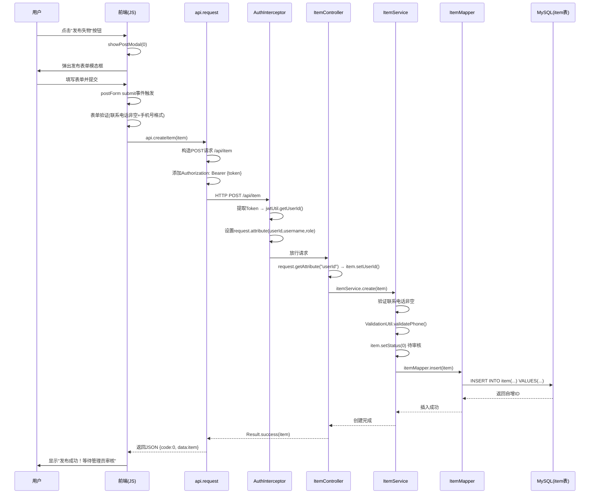

# 校园失物招领系统代码分析报告

## 一、"发布失物"完整调用链路

### 前端调用流程

1. 用户点击"发布失物"按钮 → 调用 `showPostModal(0)`（`app.js:456`），type=0 表示失物
2. `showPostModal` 弹出发布表单模态框，设置 `postType` 隐藏字段值为 0
3. 用户填写表单后点击提交 → 触发 `postForm` 的 `submit` 事件监听器（`forms.js:54`）
4. 表单验证通过后，构造 item 对象并调用 `api.createItem(item)`（`forms.js:70`）
5. `api.createItem` 调用 `api.request('/item', { method: 'POST', body: JSON.stringify(item) })`（`api.js:109`）
6. `api.request` 拼接完整 URL 为 `{config.API_BASE}/item`，附加 `Authorization: Bearer {token}` 请求头，发送 HTTP POST 请求

### HTTP 请求详情

- **URL**: `POST /api/item`
- **Content-Type**: `application/json`
- **Authorization**: `Bearer {JWT_TOKEN}`
- **Request Body**:
  ```json
  {
    "type": 0,
    "title": "...",
    "category": "...",
    "description": "...",
    "location": "...",
    "itemTime": "...",
    "contactName": "...",
    "contactPhone": "..."
  }
  ```

### 后端调用流程

1. **AuthInterceptor**（`AuthInterceptor.java:32`）拦截请求，提取 `Authorization` 头中的 JWT Token，调用 `jwtUtil.getUserId(token)` 验证 Token 并解析出 `userId`、`username`、`role`，设置到 `request.setAttribute`
2. **ItemController.create**（`ItemController.java:69`）接收请求，从 `request.getAttribute("userId")` 获取用户 ID，设置到 `item.setUserId(userId)`
3. **ItemService.create**（`ItemService.java:33`）执行业务逻辑：
   - 验证联系电话非空
   - 调用 `ValidationUtil.validatePhone` 校验手机号格式
   - 设置 `item.setStatus(0)`（待审核状态）
   - 调用 `itemMapper.insert(item)` 插入数据库
4. **ItemMapper.insert**（`ItemMapper.java:14`）执行 SQL：
   ```sql
   INSERT INTO item(user_id, title, description, category, location, images, type, status, contact_name, contact_phone, item_time, create_time, update_time)
   VALUES(#{userId}, #{title}, #{description}, #{category}, #{location}, #{images}, #{type}, #{status}, #{contactName}, #{contactPhone}, #{itemTime}, NOW(), NOW())
   ```
5. 使用 `@Options(useGeneratedKeys = true, keyProperty = "id")` 回填自增主键 ID

### 涉及的数据库表和字段

- **表**: `item`
- **字段**:
  | 字段 | 类型 | 说明 |
  |------|------|------|
  | `id` | BIGINT | 自增主键 |
  | `user_id` | BIGINT | 发布者用户ID（外键关联 user.id） |
  | `title` | VARCHAR(200) | 标题 |
  | `description` | TEXT | 描述 |
  | `category` | VARCHAR(50) | 分类 |
  | `location` | VARCHAR(200) | 地点 |
  | `images` | TEXT | 图片 |
  | `type` | TINYINT | 0:失物, 1:招领 |
  | `status` | TINYINT | 0:待审核, 1:已通过, 2:已拒绝, 3:已认领 |
  | `contact_name` | VARCHAR(50) | 联系人姓名 |
  | `contact_phone` | VARCHAR(20) | 联系电话 |
  | `item_time` | DATETIME | 丢失/捡到时间 |
  | `create_time` | DATETIME | 创建时间 |
  | `update_time` | DATETIME | 更新时间 |

### Mermaid 时序图



---

## 二、"智能匹配"功能分析

### 匹配算法实现

`ItemService.findMatches`（`ItemService.java:75`）的匹配逻辑如下：

1. 根据 itemId 查询源物品信息
2. 确定匹配目标类型：失物(type=0) → 招领(type=1)，反之亦然
3. 调用 `itemMapper.findMatches()` 执行 SQL 匹配查询

核心 SQL（`ItemMapper.xml:48`）的评分算法：

```sql
match_score =
  CASE WHEN i.category = #{category} THEN 50 ELSE 0 END
  + CASE WHEN i.location LIKE CONCAT('%', #{location}, '%')
         OR #{location} LIKE CONCAT('%', i.location, '%') THEN 30 ELSE 0 END
  + CASE WHEN ABS(DATEDIFF(i.create_time, #{createTime})) <= 7
         THEN 20 - ABS(DATEDIFF(i.create_time, #{createTime})) * 2
         ELSE 0 END
```

评分权重：分类匹配 50 分 + 地点匹配 30 分 + 时间接近 20 分（7 天内递减），总分 100 分。

### 问题一：全表扫描性能瓶颈

**问题描述**：`findMatches` SQL 对 `item` 表执行全表扫描。WHERE 条件仅有 `i.type = #{matchType} AND i.status = 1 AND i.id != #{excludeId}`，HAVING 子句中的 `match_score` 是计算字段，无法利用索引。当地点匹配条件使用 `LIKE CONCAT('%', #{location}, '%')` 时，前后均有通配符，无法命中 B-Tree 索引。随着数据量增长，查询性能将急剧下降。

**改进方案**：
- 在 `item` 表上创建 `(type, status)` 联合索引，加速 WHERE 阶段过滤
- 将地点匹配改为前缀匹配（`LIKE CONCAT(#{location}, '%')`）或使用全文索引（MySQL FULLTEXT INDEX）
- 考虑引入缓存层（如 Redis）：对于已审核通过的物品，按 `(type, category)` 维度预计算匹配结果，物品发布/状态变更时增量更新缓存
- 当数据量极大时，可考虑引入 Elasticsearch 进行全文检索和相似度匹配

### 问题二：匹配精度不足——地点模糊匹配过于粗放

**问题描述**：地点匹配条件 `i.location LIKE CONCAT('%', #{location}, '%') OR #{location} LIKE CONCAT('%', i.location, '%')` 存在严重的误匹配问题。例如，源地点为"图书馆"会匹配到"图书馆一楼"、"图书馆二楼"，但也会匹配到"数字图书馆"这种语义不同的地点。反之，源地点为"教学楼A栋101"会因"教学楼A栋" LIKE '%教学楼A栋101%' 不成立而漏掉"教学楼A栋"的匹配。此外，地点字段为自由文本，用户可能输入"一食堂"、"第一食堂"、"1食堂"等不同表述，LIKE 匹配完全无法处理这种语义等价的情况。

**改进方案**：
- 引入标准化地点字典：将 `location` 字段改为下拉选择或自动补全，存储地点编码而非自由文本，匹配时按编码精确比对
- 短期改进：对地点文本进行分词后逐词匹配，计算交集比例作为地点相似度，而非简单的 LIKE 包含关系。例如将"教学楼A栋101"拆分为 ["教学楼","A栋","101"]，将"教学楼A栋"拆分为 ["教学楼","A栋"]，计算 Jaccard 相似度为 2/3 = 0.67，按比例赋予 0~30 分
- 长期改进：使用 NLP 文本嵌入模型（如 Word2Vec/BERT）计算地点语义相似度

### 问题三：边界情况——缺少对关键输入字段的空值防护

**问题描述**：当源物品的 `category` 为 NULL 或 `location` 为空字符串时，匹配逻辑会产生意外结果：
- 若 `category` 为 NULL，SQL 中 `i.category = NULL` 结果为 UNKNOWN（非 TRUE），分类匹配分数恒为 0，但不影响查询执行
- 若 `location` 为空字符串，SQL 中 `i.location LIKE '%%'` 等价于对所有行返回 TRUE，所有相反类型的已审核物品都会获得 30 分地点匹配分数，导致匹配结果失去区分度
- 若 `createTime` 为 NULL，`DATEDIFF(i.create_time, NULL)` 返回 NULL，`ABS(NULL) <= 7` 为 UNKNOWN，时间分数恒为 0，但这不是预期行为

**改进方案**：
- 在 `findMatches` 方法入口处增加字段完整性校验：当 `category`、`location`、`createTime` 任一为空时，跳过对应的评分维度或返回空列表提示用户完善信息
- 修改 SQL 中地点匹配条件：增加 `AND #{location} != '' AND i.location IS NOT NULL AND i.location != ''` 守卫条件
- 修改 SQL 中时间匹配条件：增加 `AND #{createTime} IS NOT NULL` 守卫条件
- 在 `ItemService.create` 中将 `category`、`location` 设为必填项，从源头保证数据完整性

---

## 三、认证机制安全分析

### JWT Token 流程概述

1. **Token 生成**：用户登录时（`UserController.java:39`），验证用户名密码后调用 `jwtUtil.generateToken(userId, username, role)`，生成包含 `userId`、`username`、`role` 三个 claim 的 HMAC-SHA256 签名 JWT，过期时间默认 86400000ms（24 小时）
2. **Token 验证**：`AuthInterceptor`（`AuthInterceptor.java:32`）拦截 `/api/**` 路径（排除登录、注册、物品列表和物品详情等公开接口），从 `Authorization: Bearer {token}` 提取 Token，调用 `jwtUtil.getUserId/Username/Role` 内部调用 `verifyToken` 验证签名和过期时间
3. **前端存储**：Token 存储在 `localStorage`（`api.js:13`），每次请求通过 `Authorization` 头携带

### 安全风险一：JWT 密钥硬编码且强度不足

**风险描述**：
- `application.properties`（`application.properties:2`）中 JWT 密钥配置为 `jwt.secret=campus-lost-found-secret-key-2024`，这是一个可读的弱密钥字符串
- `JwtUtil.java:22` 中存在硬编码的默认密钥 `DEFAULT_SECRET = "campus-lost-found-secret-key-2024"`，当配置文件未加载时自动回退使用
- 该密钥同时出现在 `schema.sql` 的注释中（`schema.sql:61`）和源代码中，一旦代码仓库泄露，攻击者可以伪造任意用户的 JWT Token，冒充任何用户甚至管理员

**修复建议**：
- 使用高强度随机密钥（至少 256 位 / 32 字节随机字符串），通过环境变量或外部密钥管理服务注入，禁止写入配置文件或源代码
- 移除 `JwtUtil` 中的 `DEFAULT_SECRET` 硬编码默认值，改为启动时校验密钥必须存在且达到最小长度要求，否则拒绝启动
- 使用非对称签名算法（如 RS256）替代 HMAC-SHA256，私钥仅保存在服务端，公钥可用于验证，降低密钥泄露风险
- 将密钥从代码仓库中移除，`.gitignore` 中排除包含密钥的配置文件

### 安全风险二：Token 存储在 localStorage 易受 XSS 攻击

**风险描述**：
- 前端将 JWT Token 存储在 `localStorage`（`api.js:13`：`localStorage.setItem('token', token)`），`localStorage` 中的数据可被同源的任何 JavaScript 代码访问
- 若系统存在任何 XSS 漏洞（如物品描述中注入恶意脚本），攻击者的 JavaScript 可以直接读取 `localStorage.getItem('token')` 窃取 Token，然后冒充受害者身份发起请求
- 系统虽有前端 HTML 转义函数 `escapeHtml`（`utils.js:13`），但后端未对用户输入（`title`、`description`、`location` 等）进行服务端 XSS 过滤，若数据被其他系统或 API 消费者渲染，仍存在注入风险

**修复建议**：
- 将 Token 存储从 `localStorage` 改为 `HttpOnly` + `Secure` + `SameSite=Strict` 的 Cookie，JavaScript 无法通过 `document.cookie` 读取 HttpOnly Cookie，从根本上防御 XSS 窃取
- 后端在接收用户输入时增加服务端 XSS 过滤（如使用 OWASP Java HTML Sanitizer），对 `title`、`description`、`location`、`contactName` 等自由文本字段进行 HTML 标签和脚本标签的清洗
- 设置响应头 `Content-Security-Policy` 限制脚本执行来源，进一步缓解 XSS 风险

### 安全风险三：CORS 配置过于宽松

**风险描述**：
- `CorsFilter.java:24` 中 `Access-Control-Allow-Origin` 直接设置为请求的 `Origin` 头值，未做白名单校验，任意域名都可以携带 Cookie/Token 发起跨域请求
- `Access-Control-Allow-Headers` 设置为 `*`，允许任意自定义请求头
- `Access-Control-Allow-Credentials` 设置为 `true`，配合任意 Origin 允许，使得恶意网站可以携带用户凭证发起跨域请求，构成 CSRF 风险

**修复建议**：
- 将 `Access-Control-Allow-Origin` 改为白名单校验，仅允许前端部署域名（如 `http://localhost:8028`、生产域名等）
- `Access-Control-Allow-Headers` 改为明确列出所需头（如 `Content-Type, Authorization`）
- 如果不需要跨域携带 Cookie，可将 `Access-Control-Allow-Credentials` 设为 `false`；若必须携带，则必须严格限制 Origin 白名单

### 安全风险四：密码加密使用 MD5+固定盐，安全性不足

**风险描述**：
- `PasswordUtil.java:7-10` 使用 `MD5(密码 + 固定盐)` 的方式加密密码，MD5 已被证明存在碰撞漏洞，且固定盐（`campus_lost_found_2024`）意味着所有用户使用相同盐值，攻击者获取盐值后可以使用彩虹表批量破解
- 密码和盐的拼接方式简单（`password + SALT`），容易遭受长度扩展攻击

**修复建议**：
- 使用 BCrypt 或 Argon2 等专门为密码设计的自适应哈希算法，它们内置随机盐并支持可调工作因子
- Spring Security 的 `BCryptPasswordEncoder` 可直接集成，替换现有的 MD5 方案
- 迁移策略：新增 `password_version` 字段标识加密方式，用户登录时按旧方式验证通过后自动用新算法重新加密存储
